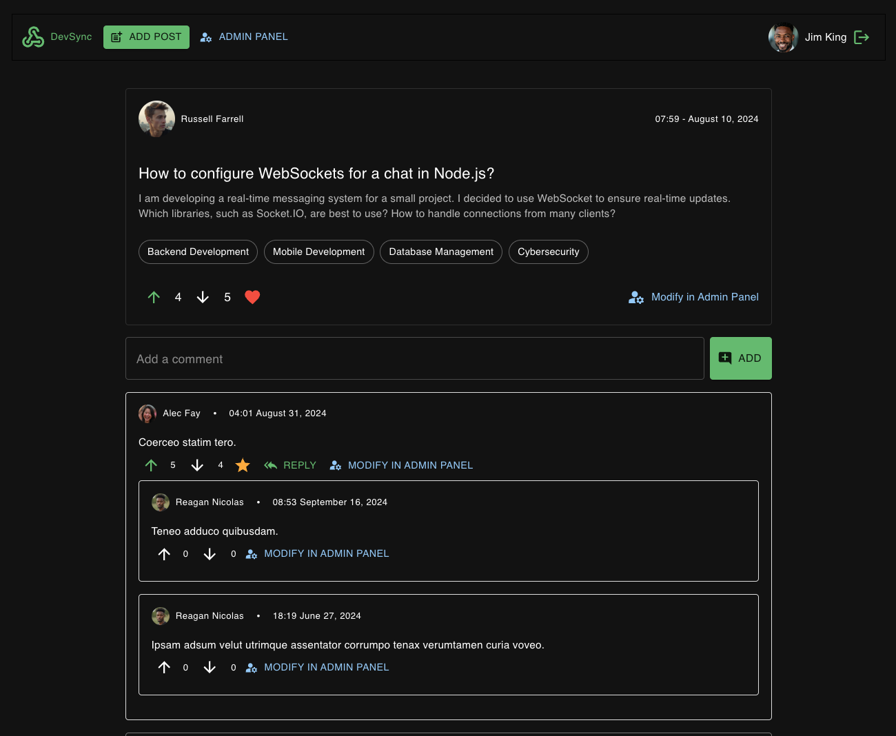
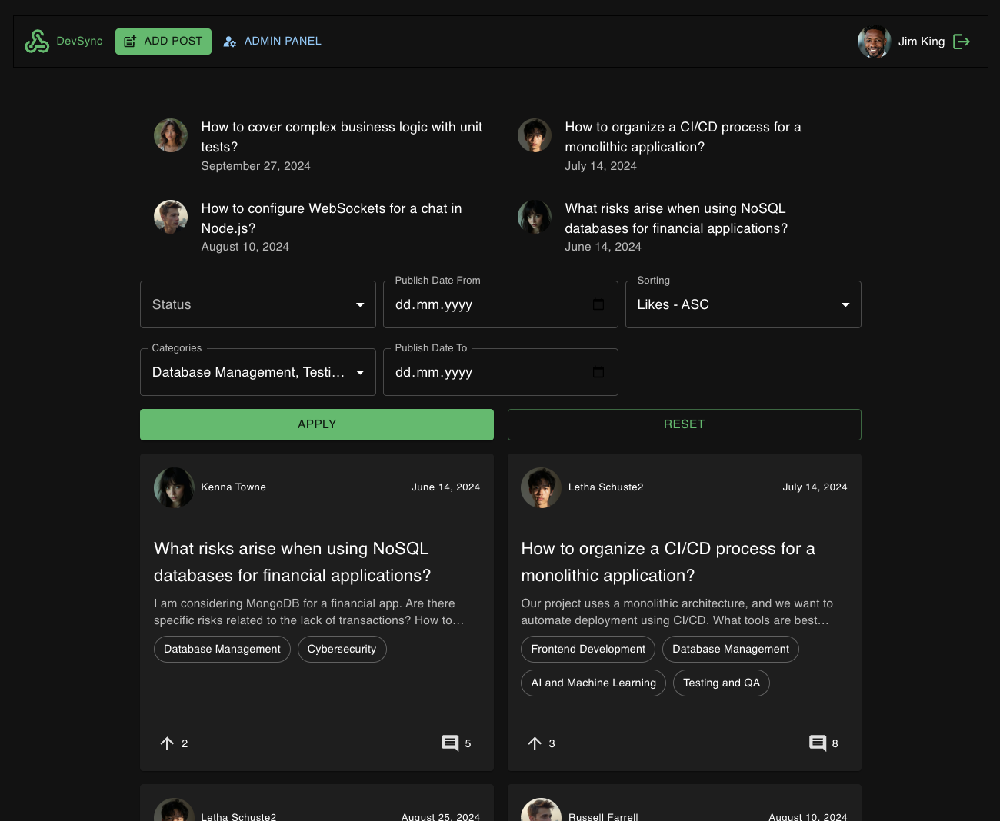

# DevSync

## Description
This project is a backend API developed using Express.js for a platform called DevSync, inspired by Stack Overflow.
The API provides functionality for users to register, log in, create questions, comment, like or dislike posts, and manage various interactions within the platform.

## Requirements
- **Node.JS** >= v22
- **NPM** >= v10
- **MySQL** >= 8.0

> 🏗️ Make sure all the necessary technologies are installed before getting started.

## Steps to Set Up the Project
1. First you need to install back-end part. Clone this repository to your local machine and navigate to the project directory.
   ```bash
   git clone https://github.com/laskevych/dev-sync.git
   ```
2. Next, you need to go to the folder with the back-end part and follow all the steps from [README.md](https://github.com/laskevych/dev-sync) there. After that, you should continue to follow the steps in this guide.
3. Install React, Redux and other front-end parts.
   ```bash
   npm install
   ```
4. Run the server to start the application.
   ```bash
   npm run start
   ```

## Test Users
- All users with the `user` role have the default password: `User#2024`. These are mock users created for demonstration purposes. Logins:
  - alec.fay 
  - letha85 
  - vesta_jacobson5 
  - reagan.nicolas16 
  - jerald_schaden 
  - diana.quigley-tromp 
  - russell11 
  - kenna67


- Admin credentials
```text
   login: admin
   password: admin@admin.com
   password: Admin#2024
```

## Using Ethereal for Email Testing
[Ethereal](https://ethereal.email/) is a free fake SMTP service for testing email functionality (e.g., with Nodemailer). To view the test emails generated by the application. Log in to Ethereal using the provided test credentials.
```text
login: martina.parisian90@ethereal.email
password: 6WmrYJ3bGkDqx3jWxq
```

## Additional Features
### Favorite Posts
Users can add posts to their favorites and view the list of their favorite posts.

### Best Comment
Post authors can mark a comment as the most useful one that solved their problem. Only the author of a post has this privilege.

### Most Interesting Posts
Administrators can select posts to feature on the site’s main page, typically showcasing the most engaging content.

## Examples
### Main Page

### User Page

### Category Page

### Post Page

### Log In Page

### Main Page as Admin


   
